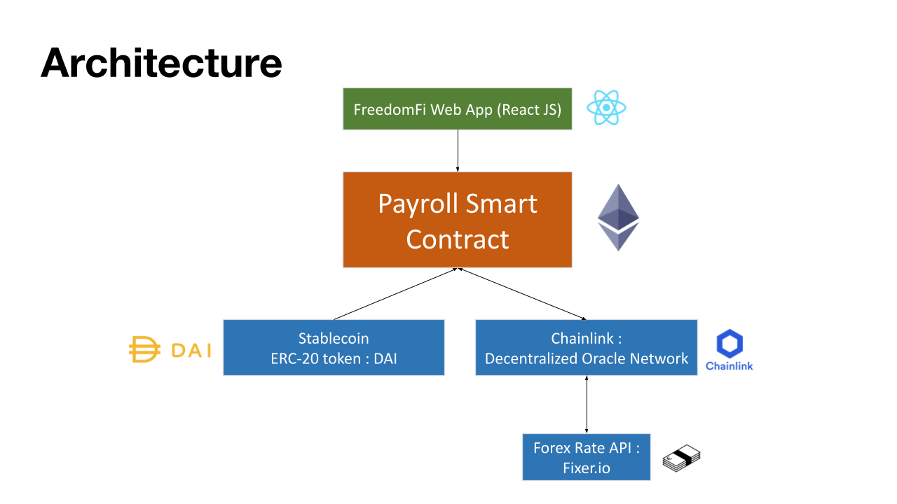

# FreedomFi: multi-currency Payroll system

### Created by Abhinay Reddy, Amiyo Chatterjee, Bruce Li, and Pritesh Soni during Ethereum Boot Camp #1 (August 22-29, 2021). Coached by Preethi Kasireddy and supported by Rajesh Muppalla.

## OVERVIEW

Salary payment to employees of companies has traditionally been very rigid with employees typically being paid in their local currency through traditional payment rails. We believe, with the advent of cryptocurrency and blockchain technology, this is a sub-optimal approach. In addition, cross-border payment has always been cumbersome with high fees and low processing time. It might be feasible for larger companies, but quite difficult for increasing numbers of small companies or organizations that employ people around the world. We propose flexibility in paying employee paychecks in a cryptocurrency of their choice. This is particularly important for employees in economies experiencing rapid currency devaluation and also for employees for whom sending international remittances is an urgent need. 


## GOALS

1. Create a payroll app where HR of a company can set up a new employee to receive salary in ETH or any ERC20 based Cryptocurrency of choice (including stablecoins like USDT or USDC) on a fortnightly basis
2. Create a User Interface that allows a HR to setup new employees to be paid in Cryptocurrency at a set frequency
3. The app will allow the employee to see his balance at any point in time
4. The app will allow the employee to withdraw their funds to a wallet at any point in time
5. To convert salary in local currency to equivalent cryptocurrency (including stablecoin): a Chainlink oracle service will be used in conjunction with a third party API (fixer.io) 


## SPECIFICATIONS

### The application has three UI screens:

1. Employee payroll record set up. Actor is HR personnel
2. View balance screen. View balance accrued to an employee. Actor is employee
3. Withdraw balance. Transfer accrued balance to wallet address. Actor is employee


### The business logic is implemented via a smart contract. There are two main entities whose data will be persisted on the blockchain:

1. Payroll record
    1. Attributes are:  Name, Annual salary, Location country, Local currency, settlement currency, wallet address (key), frequency of payment
2. Payment stream
    2. Attributes are: Employee wallet address, sender address, time of last withdrawal, salary accrual rate, balance

### Processing logic:

1. HR creates an employee's payroll record, the data gets persisted to blockchain
2. Initial value of time of last withdrawal is time when the payroll record was set up
3. Crypto asset to use for salary is set up during payroll record creation
4. At this time a payment stream record is also created
5. Employee can view their salary balance at any point, BUT no transfer of crypto to the employee’s wallet happens until employee explicitly invokes the withdraw functionality. 
6. To calculate balance, (current time - last withdrawal) time is computed, converted into number of pay intervals and multiplied by paycheck value. 
7. If the employee withdraws an amount less than the balance, the balance is updated by deducting the amount withdrawn.
8. To convert local currency to the chosen crypto asset, Chainlink’s oracle for foreign exchange rate and crypto asset price is used. 

## Architecture


## Setup, installation, and run project

### Deploy payroll contract - Local

1. Run local hardhat node 

    `npx hardhat node`

2. Run the following command to deploy faucet on localhost

    `npx hardhat run scripts/deploy.js --network localhost`

3. Copy the contract address printed to console and replace the already existing address in `src/constants.js` with it.


### Deploy payroll contract - Testnet (Rinkeby)

1. Create a file by name `.env` inside the root directory of this project. Paste the following lines inside this .env file

```
ALCHEMY_API_KEY = 'YOUR_ALCHEMY_API_KEY"
WALLET_PRIVATE_KEY = 'YOUR_WALLET_PRIVATE_KEY'
```

2. Replace `YOUR_ALCHEMY_API_KEY` with API key created using Alchemy

3. Replace `YOUR_WALLET_PRIVATE_KEY` with private key obtained by following these steps
    
    1. Click on metamask plugin icon in the browser
    2. Select `Account details`
    3. Click `Export Private Key` button and confirm your password

4. Run the following command to deploy payroll on rinkeby network

    `npx hardhat run scripts/deploy.js --network rinkeby`

5. Copy the contract address printed to console and replace the already existing address in `src/constants.js` with it.

**Note:** You can skip the contract deployment steps and by default the setup would use an already deployed contract.

### Run Project - FreedomFi Web App

1. Install dependencies

    `npm install`

2. Run app

    `npm start`

### Common hardhat console commands (If using local network to deploy)

1. Connect to the appropriate network using Hardhat console command
   
   `npx hardhat console --network rinkeby`
    
2. Get balance
    ```bash
    $ let bal = await ethers.provider.getBalance("CONTRACT_ADDR");
    $ bal
    ```
3. Convert balance to ethers
    ```bash
    $ ethers.utils.formatEther(bal);
    ```
